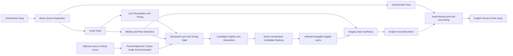

# Vietnamese-to-English Singable Song Translation System

An end-to-end **Audio AI and Natural Language Processing system** designed to convert a Vietnamese song into a **singable English version** while preserving the original melody, timing, rhythm, and overall meaning.

Unlike conventional machine translation, this project treats lyric translation as a **multi-constraint generation problem**. A successful translation must not only be semantically accurate, but must also fit the musical structure of the original song.

> **Project focus:** Singing Voice Translation, music-constrained lyric translation, source separation, melody extraction, and singing voice synthesis.

## Demo and Project Materials

- [View the technical presentation](./VIETNAMESE-TO-ENGLISH_MUSIC_CONVERSION_SYSTEM.pdf)

---

## Motivation

Music can support language learning, cross-cultural communication, and creative content production. However, translating a song is substantially more difficult than translating ordinary text.

Vietnamese is a **tonal and largely monosyllabic language**, while English is a **non-tonal, stress-timed language**. A literal translation may preserve meaning but usually cannot be sung naturally over the original melody.

The system therefore aims to solve several problems simultaneously:

- Preserve the meaning and emotional intent of the Vietnamese lyrics.
- Match English syllables to the available musical notes.
- Maintain suitable rhythm, stress, and phrase duration.
- Produce rhyme patterns that sound natural in English.
- Generate an English singing voice aligned with the original melody.
- Recombine the synthesized vocals with the original instrumental track.

---

## System Architecture

The project follows a modular, cascaded architecture with four main stages.

---

## Processing Pipeline

### 1. Audio Pre-processing

The input song is decomposed into structured musical information.

- **Music source separation:** separate the vocal track from the instrumental track.
- **Automatic lyric recognition:** transcribe the Vietnamese singing voice and recover timing information.
- **Melody extraction:** estimate pitch, note duration, and melodic contour.
- **Hybrid input support:** optionally use user-provided lyrics or a music score to improve alignment accuracy.
- **Synchronization:** apply forced alignment or score-audio synchronization when reference lyrics or sheet music are available.

Possible reference components include:

- **Demucs** for music source separation.
- **Whisper** for lyric transcription.
- **CREPE** or **Omnizart** for melody and pitch extraction.

### 2. Music-Constrained Lyric Translation

A language model generates multiple English lyric candidates for each Vietnamese line. The candidates are then ranked using several musical and linguistic objectives.

| Objective | Description |
|---|---|
| **Meaning preservation** | Retain the semantic content and emotional intent of the original lyrics. |
| **Syllable alignment** | Match the number of English syllables to the available notes. |
| **Rhythm compatibility** | Fit the translated line within the original phrase duration and rhythmic pattern. |
| **Stress placement** | Align important English stresses with musically prominent notes or beats. |
| **Rhyme consistency** | Preserve or reconstruct suitable rhyme patterns across lyric lines. |
| **Singability** | Produce natural, understandable, and performable English lyrics. |

Conceptually, the translation module performs **multi-objective optimization** rather than selecting the most literal translation.

### 3. Singing Voice Synthesis

The selected English lyrics and the extracted melody are used to synthesize an English singing voice.

The synthesis stage contains two main components:

1. An **acoustic model**, potentially based on a Transformer or diffusion architecture, predicts a mel-spectrogram from the English lyrics and melody.
2. A **neural vocoder**, such as HiFi-GAN, converts the mel-spectrogram into an audio waveform.

The generated vocal track is expected to follow the pitch and timing of the original performance while producing intelligible English pronunciation.

### 4. Audio Mixing and Post-processing

The synthesized English vocals are combined with the separated instrumental track.

Post-processing may include:

- Vocal and instrumental volume balancing.
- Timing correction.
- Noise reduction.
- Loudness normalization.
- Final audio rendering.

The final output is a complete English version of the original Vietnamese song.

---

## Key Technical Challenges

### Cross-lingual Singability

A translation can be grammatically correct but impossible to sing. The system must optimize language quality and musical compatibility at the same time.

### Tonal-to-Stress-Timed Translation

Vietnamese tones influence lexical meaning, whereas English relies heavily on stress placement. Mapping between these systems requires careful handling of pitch movement, syllables, and emphasis.

### Error Propagation

Because the architecture is cascaded, errors in source separation, lyric recognition, or melody extraction can affect all later stages. The hybrid input design helps reduce this problem by allowing reference lyrics or sheet music.

### Natural Singing Voice Generation

The synthesized English vocal must remain intelligible, rhythmically aligned, and musically expressive without losing the structure of the original melody.

---

## Expected Outputs

The system is designed to produce three main outputs:

1. **Singable English Lyrics**  
   English lyrics that preserve meaning while fitting the melody, rhythm, and syllable structure of the original song.

2. **English Vocal Track**  
   A synthesized English singing voice aligned with the extracted melody.

3. **Complete English Song**  
   A final audio file created by mixing the synthesized vocals with the original instrumental track.

A future web interface can allow users to upload a Vietnamese song, optionally provide lyrics or sheet music, and receive the generated English version.

---

## Intended Workflow

1. Upload a Vietnamese song.
2. Optionally provide verified lyrics or a music score.
3. Separate vocals and instrumental audio.
4. extract lyrics, timing, pitch, and note duration.
5. Generate multiple English lyric candidates.
6. Rank the candidates using semantic and musical constraints.
7. Synthesize the English singing voice.
8. Mix the generated voice with the instrumental track.
9. Export the completed English audio version.

---

## Potential Applications

- Language-learning content built around familiar Vietnamese songs.
- Cross-cultural music adaptation.
- AI-assisted lyric translation.
- Support tools for singers, cover artists, and content creators.
- Research in multilingual singing voice synthesis.
- Human-in-the-loop tools for professional lyricists and music producers.

---

## Research Contributions

This project explores a unified system that connects several AI areas:

- **Natural Language Processing**
- **Machine Translation**
- **Large Language Models**
- **Music Information Retrieval**
- **Automatic Speech Recognition**
- **Audio Source Separation**
- **Singing Voice Synthesis**
- **Multi-objective Optimization**

The central idea is to treat lyric translation as a joint linguistic and musical task instead of a text-only translation problem.

---

## Current Scope

This repository currently focuses on:

- Problem formulation.
- End-to-end system architecture.
- Research-driven module selection.
- Music-constrained translation objectives.
- Technical documentation and presentation materials.

The modular design allows each component to be implemented, replaced, and evaluated independently before full-system integration.

---

## Future Development

- Build the source-separation and melody-extraction pipeline.
- Develop timestamp-aware Vietnamese lyric recognition.
- Implement multi-candidate English lyric generation.
- Design a weighted ranking function for meaning, syllables, rhythm, stress, and rhyme.
- Integrate an English singing voice synthesis model.
- Add human evaluation for meaning, naturalness, and singability.
- Develop a web-based demonstration interface.
- Support additional language pairs and controllable singing styles.

---

## References

1. Linan Ou, Xiaojuan Ma, Min-Yen Kan, and Ye Wang. **Songs Across Borders: Singable and Controllable Neural Lyric Translation.** ACL, 2023.
2. Jinglin Liu, Chengxi Li, Yi Ren, Feilong Chen, and Zhou Zhao. **DiffSinger: Singing Voice Synthesis via Shallow Diffusion Mechanism.** AAAI, 2022.
3. Simon Rouard, Francisco Massa, and Alexandre Défossez. **Hybrid Transformers for Music Source Separation.** ICASSP, 2023.
4. Yu-Te Wu, Berlin Chen, and Li Su. **Multi-Instrument Automatic Music Transcription with Self-Attention-Based Instance Segmentation.** IEEE/ACM Transactions on Audio, Speech, and Language Processing, 2021.
5. Chengxi Li, Kai Fan, Jiajun Bu, Boxing Chen, Zhongqiang Huang, and Zhi Yu. **Translate the Beauty in Songs: Jointly Learning to Align Melody and Translate Lyrics.** Findings of EMNLP, 2023.

  <b>Bridging languages through melody, rhythm, and artificial intelligence.</b>

